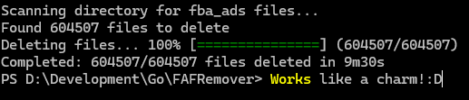

# fba_ads-FileRemover

A Windows CLI tool to remove Facebook Ads files from your system. This tool requires administrator privileges to run.



## Download

1. Go to the [Releases](https://github.com/SamTheDevDE/fba_ads-FileRemover/releases) tab
2. Download the latest `fba_ads-FileRemover.zip` file
3. Unarchive the `fba_ads-FileRemover.zip` file and extract the content into a folder
4. Open a terminal in the folder where the `fba_ads-FileRemover.exe` is located
5. run for example this command: `fba_ads-FileRemover.exe --dir=C:/`

### What does this command do?

- `fba_ads-FileRemover.exe`: The program executable
- `--dir=C:/`: Specifies which directory to scan for fba_ads files
  - Example: `--dir=D:/Downloads` would scan the Downloads folder
  - Example: `--dir="C:/Program Files"` for paths with spaces
  - Example: `--dir=.` for current directory

The program will:
1. Check for administrator rights
2. Scan the specified directory (no subdirectories)
3. Show how many fba_ads files were found
4. Delete them with a progress bar
5. Show a completion summary

## Building from Source

### Prerequisites

- Go 1.20 or higher
- Git

### Steps to Build

1. Clone the repository:
```bash
git clone https://github.com/SamTheDevDE/fba_ads-FileRemover.git
cd fba_ads-FileRemover
```

2. Install dependencies:
```bash
go get github.com/schollz/progressbar/v3
go get golang.org/x/sys/windows
```

3. Build the executable:
```bash
go build -o fba_ads-FileRemover.exe
```

## Usage

Run the program as administrator with the following syntax:
```bash
fba_ads-FileRemover.exe --dir=C:
```

Replace `C:` with the drive or directory you want to scan.

## Features

- Administrator privileges check
- Recursive directory scanning
- Progress bar with estimated time remaining
- Detailed completion summary
- Safe file deletion with error handling

## Requirements

- Windows operating system
- Administrator privileges

## License

MIT License